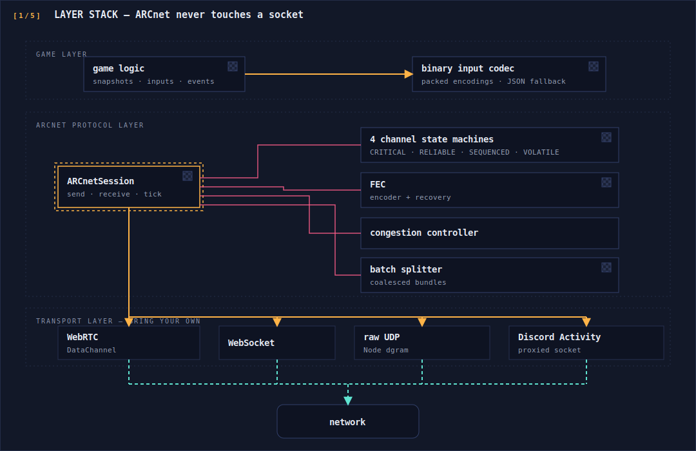
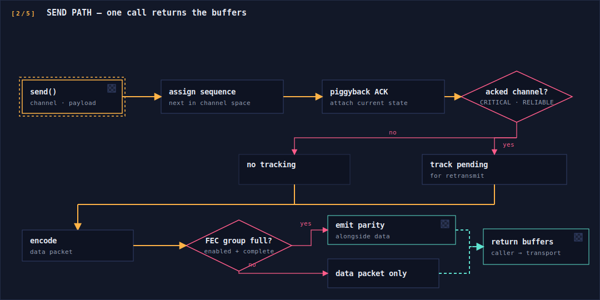
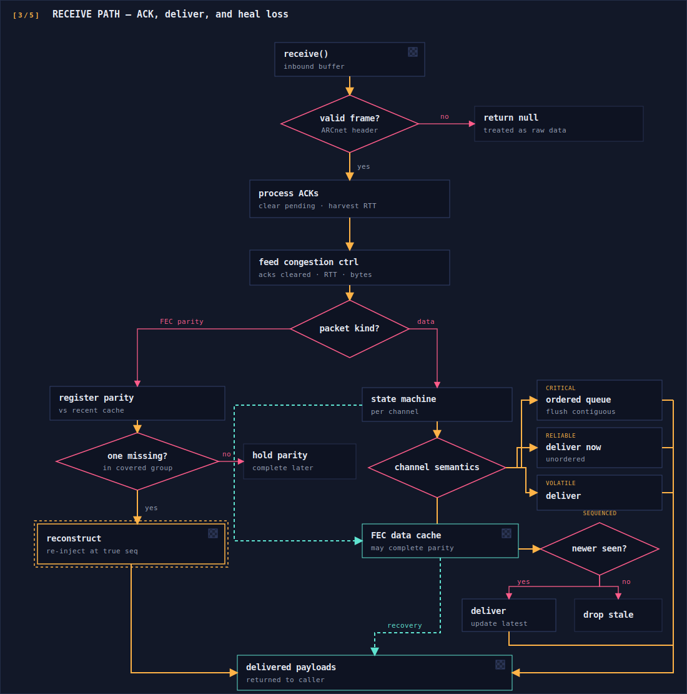
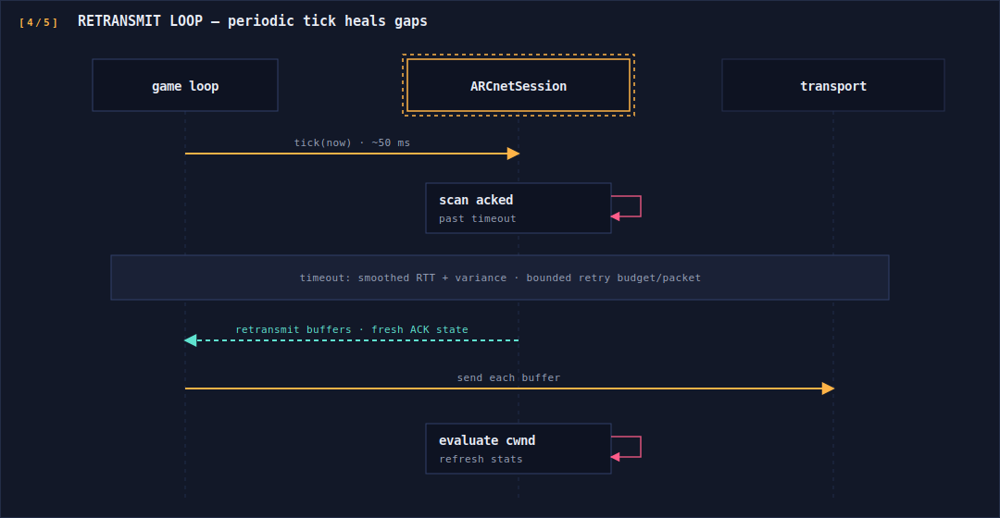
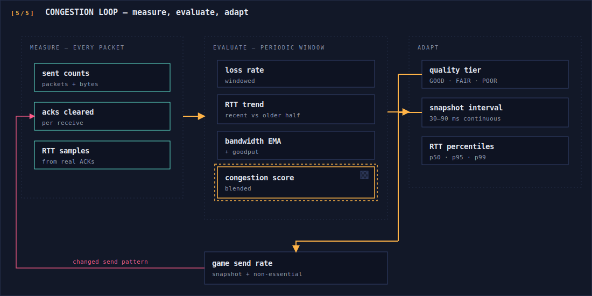

# ARCnet Architecture

ARCnet is a session-oriented reliability layer that sits between game logic and any byte transport. This document describes the system's structure and data flows. Wire-format specifics and the novel algorithms (FEC construction, congestion scoring, retransmit policy) are described conceptually — the implementations are proprietary.

## Layer Stack

The core design rule: **ARCnet never touches a socket.** It consumes and produces `ArrayBuffer`s; everything above and below it is swappable.



Each channel owns an independent 16-bit sequence space and its own delivery semantics, so a burst of volatile cosmetic traffic can never stall critical match events.

## Packet Anatomy (conceptual)

Every packet carries a small fixed header ahead of the payload:

- a **magic byte** so ARCnet frames are cheaply distinguishable from raw application data sharing the same transport;
- a packed field encoding the **channel**, the **packet kind** (normal data vs. FEC parity vs. control), and a **wire version** so decoders reject unknown formats cleanly;
- the packet's **per-channel sequence number**;
- **piggybacked ACK state**: the highest sequence received from the peer plus a selective-ACK bitfield covering a window of recent packets.

Because ACK state rides on every packet, steady-state play needs no dedicated ACK traffic in either direction.

## Send Path



The sender is synchronous and allocation-light: one call returns the exact buffers to put on the wire. On FEC-enabled channels, every N-th send additionally yields one parity packet protecting the just-completed group.

## Receive Path — ACK, Delivery, and FEC Recovery



Two properties worth noting:

- **Recovery is bidirectional.** A parity arriving before its data packets is held; a data packet arriving later can complete the group and trigger recovery. Either arrival order heals the loss.
- **Recovered packets are first-class.** They re-enter the same channel state machine under their original sequence number, so ordering and ACK bookkeeping stay consistent. Bounded caches (recent-data and pending-parity stores with FIFO eviction) keep memory flat under sustained loss.

## Retransmit Loop

Acked channels keep unacknowledged packets in a pending map. A periodic `tick()`:



Retransmits are re-encoded with *current* ACK state, so even a retransmission carries fresh acknowledgement information. Packets exceeding the retry budget are dropped rather than retried forever.

## Congestion Control Loop

The controller is a closed loop between measurement and the game's send rate:



Key ideas, conceptually:

- **Trend, not just level.** Comparing recent RTT samples against older ones detects queue buildup *before* loss occurs, so throttling can begin early.
- **Continuous output.** The blended congestion score maps onto a smooth recommended snapshot interval rather than discrete steps, avoiding oscillation and visible rate "gear shifts." The discrete tier remains available for simple branching.
- **Honest tail latency.** Percentile RTT (p50/p95/p99) is computed from the live sample window — the p95/p99 signals drive interpolation-buffer sizing on jittery mobile links where averages are misleading.

## Transport Abstraction

The integration contract is deliberately minimal — a transport only needs to move buffers:

```ts
interface ByteTransport {
  send(buf: ArrayBuffer): void;
  onMessage(handler: (buf: ArrayBuffer) => void): void;
}

function bind(session: ARCnetSession, t: ByteTransport) {
  t.onMessage((buf) => {
    for (const b of unbatch(buf)) {           // transparently split coalesced bundles
      const delivered = session.receive(b);
      if (delivered) dispatch(delivered);
      else handleRaw(b);                       // non-ARCnet traffic passes through
    }
  });
}
```

Because `receive()` returns `null` for non-ARCnet buffers, the protocol can share a transport with legacy or out-of-band messages — which is how it was rolled into a live game incrementally. The Discord Activity case demonstrates the payoff: the entire adaptation is a one-time transport-level URL re-mapping through Discord's proxy plus an identity handshake; the protocol layer is byte-for-byte identical to the standalone web build.

## Companion Codec

Above ARCnet, a packed binary codec encodes per-tick input and fire events at an 80–85% size reduction versus JSON. Each encoding leads with a distinct tag byte, chosen not to collide with JSON or other binary message types on the same channel, so receivers branch cheaply and fall back to JSON for anything untagged. The codec is an application-level pattern — its field layout is game-specific by design.
